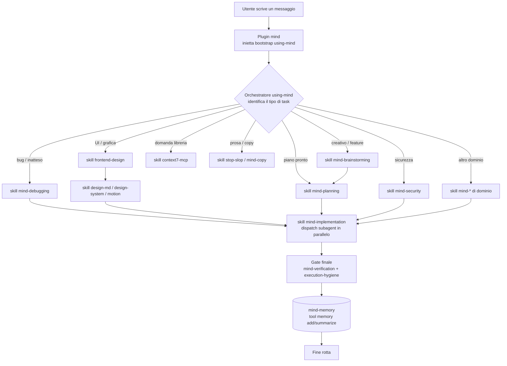
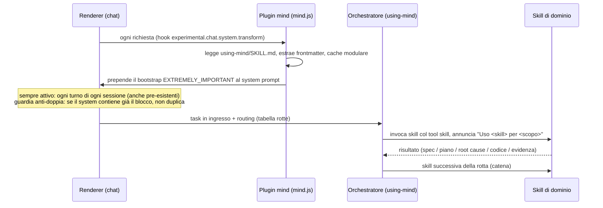
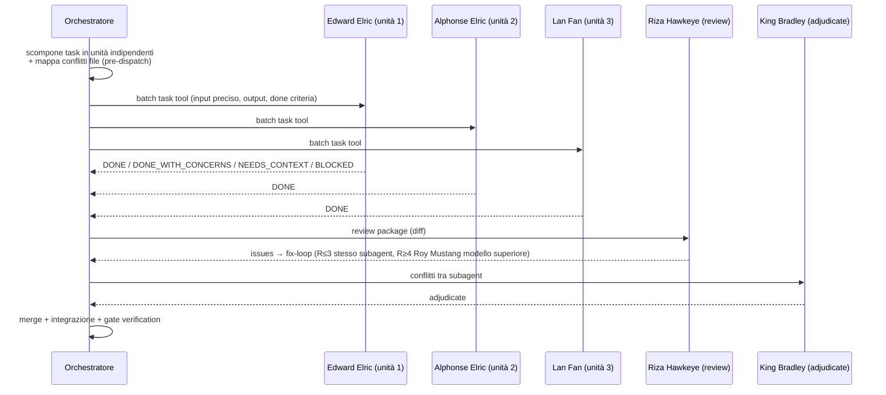

# mind-system

Sistema mind: skill + orchestrazione + memoria.

Sistema di skill completo per opencode: orchestrazione a 360° (routing intelligente delle skill), plugin `mind` (orchestratore) e plugin `mind-memory` (memoria locale-first con cloud opzionale), fork personale dei plugin originali che rallentavano l'avvio.

> I diagrammi di questo README sono **Mermaid** (renderizzati automaticamente da GitHub). Una copia estesa è in `docs/system-diagram.md`.

## Struttura

- `config/` — configurazione opencode (`opencode.jsonc`, `mind-memory.json`, `vibeguard.config.json`, `dcp.jsonc`, `AGENTS.md`). Le chiavi API sono sostituite con placeholder `${VAR}`; i valori reali vanno nel file `.env` locale (vedi `.env.example`).
- `plugins/` — plugin locali fork personali: `mind` (orchestratore, inietta il bootstrap e registra le skill) e `mind-memory` (memoria locale-first). Vanno copiati in `~/.config/opencode/plugins/` e referenziati con `file:` nel config.
- `skills/` — skill custom dell'agente: il fork `mind/` con l'orchestratore `using-mind` e 28 skill di dominio, più le skill storiche (context7-mcp, design-md, design-system, ecosystem-health-check, execution-hygiene, frontend-design, motion, orchestrator, stop-slop). Le directory node_modules sono escluse.
- `docs/` — documentazione e note decisionali, incluso `system-diagram.md`.

> La memoria supermemory non è più usata: sostituita dal plugin locale `mind-memory` (storage in `~/.local/share/opencode/mind-memory/memories.json`, cloud opzionale disattivato se non configurato).

## Diagramma del flusso

### Flusso complessivo (attivazione → routing → esecuzione → gate → memoria)



**Catena tipica**: `brainstorming` → spec → `planning` → piano → `implementation` (subagent FMA in parallelo) → `verification` (evidenza) → `mind-memory` (memoria).

### Attivazione (bootstrap del plugin)



- Il plugin **mind** fa solo 2 cose: registra la dir skill in `config.skills.paths` e inietta il bootstrap nel system prompt a ogni turno. Nessuna rete, nessun update-check (motivo: niente lentezza all'avvio).
- Il plugin **mind-memory** è locale-first: legge `mind-memory.json` (cloud opzionale), storage in `~/.local/share/opencode/mind-memory/memories.json`.

## Routing completo (come si attiva ogni skill)

| Tipo di task | Rotta (in ordine) | Si attiva quando... |
|---|---|---|
| Nuova feature / creativo | `mind-brainstorming` → `mind-planning` → `mind-implementation` → `mind-verification` | task nuovo, vago, da progettare |
| Feature semplice ben definita | `mind-planning` → `mind-implementation` → `mind-verification` | requisiti già chiari |
| UI (costruire/modificare) | `frontend-design` → `design-md` (solo se manca DESIGN.md) → `design-system` → `motion` (solo animazioni) → `mind-verification` | tocca interfaccia/grafica |
| UI (solo ritocco stile) | `design-system` → `mind-verification` | piccola modifica stile |
| Animazione / motion / 3D | `motion` → `frontend-design` (se serve direzione) → `mind-verification` | tocca animazioni/3D |
| Prosa / testi (pulizia) | `stop-slop` | rimuovere pattern AI |
| Copywriting (creazione) | `mind-copy` → `stop-slop` → (`frontend-design` se in UI) → `mind-verification` | scrivere testi nuovi |
| Bug / comportamento inatteso | `mind-debugging` → `mind-implementation` (TDD) → `mind-verification` | comportamento sbagliato |
| Bug hunting proattivo | `mind-debugging` (sezione bug hunting) → `mind-testing` → `mind-verification` | review difensiva |
| Sicurezza / breach | `mind-security` → `mind-implementation` (fix) → `mind-verification` | auth, dati sensibili, rete |
| Ricerca / scelta libreria | `mind-research` (→ `context7-mcp`) | comparazione con fonti |
| Performance | `mind-performance` (misura PRIMA) → `mind-implementation` → `mind-verification` | lentezza/carico |
| Dati / database / ETL | `mind-data` → (`mind-implementation` se codice) → `mind-verification` | query/schema/dati |
| Test | `mind-testing` → `mind-verification` | strategia/scrittura test |
| Documentazione | `mind-docs` → `mind-verification` | README/API/guide |
| Migrazione / upgrade | `mind-migration` → `mind-implementation` → `mind-verification` | cambio stack/versioni |
| Refactoring (no stack change) | `mind-refactor` → `mind-verification` (→ `mind-debugging`/`mind-migration` se emerge) | pulire/riorganizzare codice |
| API / contratti | `mind-api` → (`mind-security` se auth) → `mind-implementation` → `mind-verification` | endpoint/consumo terze parti |
| Deploy / CI-CD / infra | `mind-devops` → `mind-verification` | build/deploy/pipeline |
| Release / versioning | `mind-release` → `mind-devops` → `mind-verification` | versione/changelog/tag |
| Comprendere codice sconosciuto | `mind-explore` (digest) → (`mind-docs` se da documentare) → `mind-memory` | onboarding/impatto cambio |
| Decisione architetturale | `mind-brainstorming` (spec) → `mind-architecture` (ADR) → `mind-planning` | ADR, trade-off di design |
| Incidente in produzione | `mind-incident` → (`mind-debugging`/`mind-security`/`mind-devops`) → `mind-docs` (postmortem) → `mind-verification` | servizio giù/degrado |
| Localizzazione / i18n | `mind-i18n` → `mind-implementation` → `mind-testing` → `mind-verification` | lingue/traduzioni/RTL |
| Valutare prompt/agent/skill | `mind-eval` (report) → l'orchestratore applica le modifiche | testare il sistema stesso |
| Piano multi-step | `mind-planning` → `mind-implementation` → `mind-verification` | piano pronto |
| Obiettivo complesso / piano da eseguire per intero in autonomia (multi-sessione, "finisci da solo") | `mind-runner` (coda persistente + loop + checkpoint + gate verde) | lavoro lungo da portare a termine senza conferma a ogni task |
| Domanda libreria/framework | `context7-mcp` | domanda diretta |
| Consulenza / ragionamento / strategia / confronto / valutazione (NON costruire) | `mind-consult` (via subagent `sage` = Van Hohenheim) | "cosa mi consigli", "come miglioreresti", decisioni |
| Init progetto | `ecosystem-health-check` → `mind` (routing) → `design-md`/`design-system` (se UI) | nuovo progetto |
| Review codice | `mind-implementation` (review+fix-loop) / `mind-verification` | PR/review |
| Richiamo lavoro precedente | `memory` tool (search) via `mind-memory` | "come avevamo fatto..." |
| Richiamo con storico completo | `memory` search → `mind-recall` (storico sessioni, sola lettura) | la memoria non basta, serve lo storico |
| Prima configurazione / progetto nuovo | `mind-setup` (domande una alla volta → working-set) → rotta del task | primo messaggio senza config salvata |
| Documenti (PDF/DOCX/XLSX/PPTX) | `mind-documents` → (`mind-copy` per il testo) → `mind-verification` | file documento |
| Git workflow / branch / commit / worktree | `mind-git` → `mind-verification` | versionamento, PR, parallelismo |
| Riepilogo sessione | `memory` tool (summarize) via `mind-memory` | "riepiloga la sessione" |
| Salvataggio preferenza/contesto | `memory` tool (add) via `mind-memory` | "ricorda che..." |

**Precedenze chiave**:
1. `mind`/`using-mind` è l'entry point, decide la rotta (mai le skill da sole).
2. Process skill PRIMA (brainstorming/debugging impostano l'approccio), skill di contenuto DOPO.
3. `frontend-design` PRIMA di `design-system` e `motion`.
4. `mind-security` PRIMA di qualsiasi codice che tocca auth/dati sensibili/rete.
5. `mind-verification` + `execution-hygiene` SEMPRE gate finale.
6. Le istruzioni utente (AGENTS.md, richieste dirette) prevalgono sulle skill.
7. Skill di dominio entrano SOLO se il task tocca quel dominio.
8. `mind-setup` è il gate iniziale su progetto nuovo; `mind-recall` è il fallback del richiamo (dopo `memory` search); gli MCP si invocano SOLO on-demand, mai all'avvio.
9. `mind-runner` entra SOLO per un piano/obiettivo da eseguire per intero in autonomia (più task, possibilmente più sessioni). Un task singolo NON usa il runner.
10. `mind-consult` (subagent `sage`) entra SOLO per domande meta/consultive — pensare, consigliare, decidere — non per costruire/modificare codice. Se il parere sfocia in lavoro, si torna alla rotta di implementazione.

**Casi limite**: UI+BE → rotta del dominio predominante, gate unico. Dubbio → route conservativa. Fix rapido di bug già investigato → salta `mind-debugging`. Refactor vs migration → senza cambio stack = refactor. Copy vs pulizia → creare = `mind-copy`, pulire = `stop-slop`. Incident vs bug → produzione giù = `mind-incident`. Richiamo vs recall → prima `memory` search, poi `mind-recall`. Documenti vs codice → file .pdf/.docx/.xlsx/.pptx = `mind-documents`. Runner vs task singolo → un obiettivo/piano da portare a termine in autonomia = `mind-runner`; un singolo task = rotta specifica. Consulenza vs costruzione → "cosa mi consigli / come miglioreresti / è una buona idea" = `mind-consult` (subagent `sage`); se il consiglio sfocia in lavoro → rotta normale; se valuta il sistema → `mind-eval`; se è una decisione architetturale → `mind-architecture`.

## Agenti FMA — come vengono chiamati e quando

```mermaid
flowchart LR
    subgraph DISPATCH[Subagent in parallelo - mind-implementation]
        direction LR
        A1[Edward Elric<br/>implementer principale]
        A2[Alphonse Elric<br/>implementer supporto]
        A3[Alex L. Armstrong<br/>implementer robusto]
        A4[Lan Fan<br/>implementer veloce]
    end

    subgraph SPECIALI[Ruoli specializzati]
        S1[Scar - debugging/root cause]
        S2[Winry Rockbell - fix meccanici]
        S3[Ling Yao - ricerca]
        S4[Greed - performance]
        S5[Izumi Curtis - test]
        S6[Maes Hughes - documentazione]
    end

    subgraph GATE[Gate e arbitrato]
        G1[Roy Mustang - review/escalation]
        G2[Riza Hawkeye - verifica/evidenza]
        G3[Olivier M. Armstrong - gate qualità]
        G4[Van Hohenheim - architettura/consulenza (Sage)]
        G5[King Bradley - adjudicate/conflitti]
    end

    DISPATCH --> GATE
    SPECIALI --> GATE
```

| Ruolo del subagent | Personaggio FMA | Si attiva quando... |
|---|---|---|
| Implementer principale | Edward Elric | default dell'implementazione |
| Implementer di supporto | Alphonse Elric | secondo implementer in parallelo |
| Implementer robusto/meccanico | Alex Louis Armstrong | task pesanti multi-file |
| Implementer veloce/leggero | Lan Fan | task piccoli e rapidi |
| Fix meccanici | Winry Rockbell | riparazioni puntuali |
| Debugging / root cause | Scar | analisi distruttiva-creativa |
| Ricerca / comparazione | Ling Yao | `mind-research` |
| Ottimizzazione | Greed | `mind-performance` |
| Review / escalation | Roy Mustang | fix-loop R≥4, review del diff |
| Verifica / evidenza | Riza Hawkeye | `mind-verification` |
| Test rigorosi | Izumi Curtis | `mind-testing` |
| Documentazione | Maes Hughes | `mind-docs`, report |
| Gate / qualità severa | Olivier Mira Armstrong | gate finale |
| Architettura / visione / consulenza (Sage) | Van Hohenheim | design, pianificazione, domande meta/consultive (mind-consult) |
| Arbitro finale / adjudicate | King Bradley | conflitti tra subagent |

**Regole**: il nome del personaggio è usato OGNI volta che si dispatcha un subagent (rotazione), nel prompt e nel report (`**Edward Elric** (implementer): DONE`). **Ogni tanto** (non sempre) si apre il prompt/report con una battuta dell'anime (elenco in `fma-agents.md`), max una per subagent, coerente col contesto.

**Flusso di esecuzione parallela**:


## Memoria (mind-memory)

```mermaid
flowchart TD
    subgraph IN[Hook chat.message - rileva intento]
        R1[Ricorda: regex ricorda/memorizza] --> T1[tool memory add]
        R2[Dimentica: regex dimentica/elimina] --> T2[tool memory forget]
        R3[Riepiloga: regex riepiloga la sessione] --> T3[tool memory summarize]
        R4[Recall: pattern come avevamo fatto/ricordi/precedente/continua] --> T4[tool memory search]
    end

    subgraph TOOL[Tool memory - modes]
        T1 --> S1[(memories.json<br/>scope user|project)]
        T3 --> S1
        T4 --> S1
        T2 --> S1
        T5[tool memory list / profile / help] --> S1
    end

    S1 --> SEARCH[searchLocal<br/>tokenizzazione + punteggio pesato]
    S1 -. cloud opzionale .-> CL[(baseUrl + apiKey<br/>se configurato)]
```

**Dettagli**:
- **Storage**: file JSON `~/.local/share/opencode/mind-memory/memories.json` — struttura `{memories:[{id, content, scope, type, title, metadata, createdAt, updatedAt}]}`. Niente BOM (UTF-8 puro).
- **Scope**: `user` (preferenze globali) / `project` (contesto di progetto).
- **Search locale**: tokenizzazione (lowercase + NFD senza accenti + split), punteggio pesato (token esatto = 1, substring = 0.5), sort per score poi updatedAt desc, top N (default 5).
- **Cloud (opzionale)**: solo se `mind-memory.json` ha `baseUrl` E `apiKey`; timeout 5s, errori silenziosi, mai bloccante. In questo repo è locale-only.
- **Auto-memory**: a fine rotta, le skill salvano pattern, decisioni, errori superati e architettura (tool `memory` add).
- **Recall intelligente**: quando l'utente dice "come avevamo fatto...", "ricordi...", "continua/riprendi..." → il plugin inietta una directive sintetica che impone di cercare nelle memorie PRIMA di rispondere.

### RAG?

**Non è RAG.** `mind-memory` fa **retrieval lessicale locale** (parole chiave + punteggio pesato), non embedding/vector DB. Un vero RAG richiederebbe un motore vettoriale (es. ChromaDB, Qdrant) con indicizzazione semantica: non c'è. Se in futuro si volesse RAG, si aggiungerebbe un motore di embedding locale (es. `@xenova/transformers` o SQLite-vec) mantenendo l'interfaccia del tool `memory` invariata. L'unico "recall" è la ricerca pesata su file JSON + cloud opzionale non configurato.

## Comunicazione tra skill (richiami)

| Da | A | Cosa passa |
|---|---|---|
| `mind-brainstorming` | `mind-planning` | spec approvato (`docs/specs/...`) |
| `mind-planning` | `mind-implementation` | piano (header + task) |
| `mind-debugging` | `mind-implementation` | root cause + test che fallisce |
| `mind-security` | `mind-implementation` | threat model e vettori |
| `mind-research` | `mind-planning`/`implementation` | raccomandazione con fonti |
| `mind-performance` | `mind-implementation` | baseline + collo di bottiglia |
| `mind-data` | `mind-implementation` | schema/query/analisi verificate |
| `mind-testing` | `mind-implementation` | strategia + test (TDD) |
| `mind-migration` | `mind-implementation` | delta + punto di rollback |
| `mind-refactor` | `mind-debugging`/`mind-migration` | bug emerso / upgrade necessario |
| `mind-refactor` | `mind-testing` | rete di sicurezza (baseline verde) |
| `mind-api` | `mind-security`/`docs`/`migration` | threat model / contratto / breaking change |
| `mind-release` | `mind-devops`/`mind-verification` | build/publish / gate build+test |
| `mind-explore` | `mind-docs`/`mind-memory` | Codebase Digest → docs/mappa |
| `mind-architecture` | `mind-planning`/`api`/`security`/`migration` | ADR come vincolo |
| `mind-copy` | `stop-slop`/`frontend-design`/`memory` | creazione → pulizia → estetica → tono |
| `mind-incident` | `debugging`/`security`/`devops`/`docs` | root cause / breach / rollback / postmortem |
| `mind-i18n` | `implementation`/`testing`/`verification` | chiavi/struttura → test per lingua → evidenza |
| `mind-eval` | orchestratore | report → modifiche sistema (eval prima/dopo) |
| `mind-planning` | `mind-runner` | piano (header + task) → coda persistente |
| `mind-runner` | `mind-implementation`/`mind-verification`/`mind-git`/`mind-memory` | loop: task→gate→commit+push→checkpoint, ripresa tra sessioni |
| `design-system`/`motion` | `frontend-design` | delega direzione estetica |
| qualunque rotta | `mind-verification` | gate finale (evidenza) |
| qualunque rotta | `mind-memory` | salvataggio pattern/decisioni |

## Gate finale (regole di orchestrazione)

1. **Review intermedia** tra `mind-planning` → `mind-implementation` (piano vs spec, prima del dispatch).
2. **Regression check** nel gate: modifiche a codice esistente → verifica che il comportamento precedente continui a funzionare.
3. **Auto-scrittura in memoria** a fine rotta.
4. **Controllo conflitti file pre-dispatch** dei subagent paralleli.
5. **Delivery in fasi** per feature grandi.
6. **Design debt check** post-build (rotta UI: DESIGN.md aggiornato).
7. **Nessuna affermazione di completamento senza evidenza fresca** (`mind-verification`).

## Skill mind

L'orchestratore `using-mind` decide la rotta per ogni task e coordina la comunicazione tra skill (vedi `skills/mind/using-mind/routing.md`). Skill di dominio (28): brainstorming, planning, implementation (multi-subagent in parallelo con agenti FMA), verification, debugging, security, research, performance, data, testing, docs, migration, devops, refactor, api, release, explore, architecture, copy, incident, i18n, eval, **recall** (storico sessioni), **setup** (prima configurazione), **documents** (PDF/DOCX/XLSX/PPTX), **git** (workflow versionamento), **runner** (esecuzione autonoma di un piano/obiettivo con coda persistente e checkpoint), **consult** (consulenza/ragionamento/strategia via subagent Sage).

## Ripristino

- Copia i file in `~/.config/opencode/` e `~/.agents/skills/`.
- Riapplica i valori reali delle chiavi nel file `.env` o direttamente nei config.
- Riavvia opencode (la config non è hot-reload).